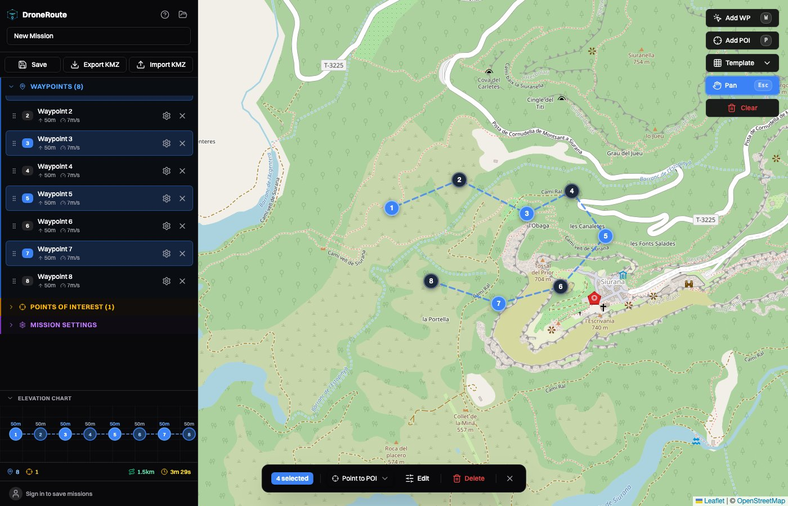
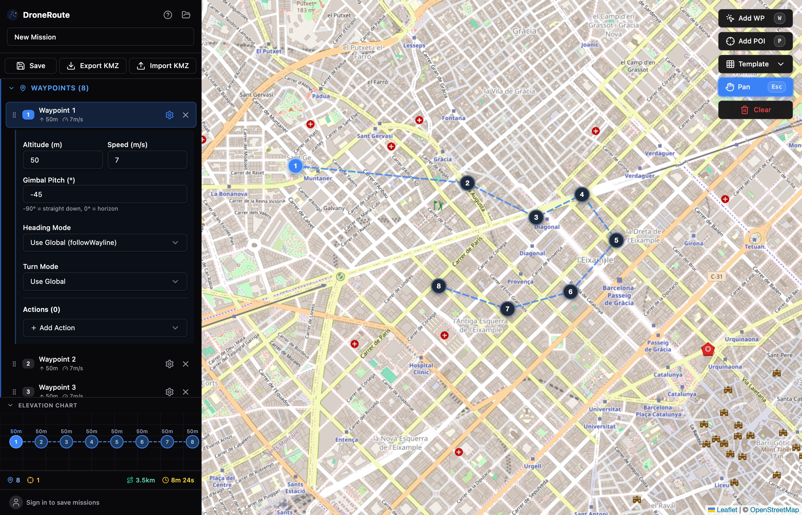
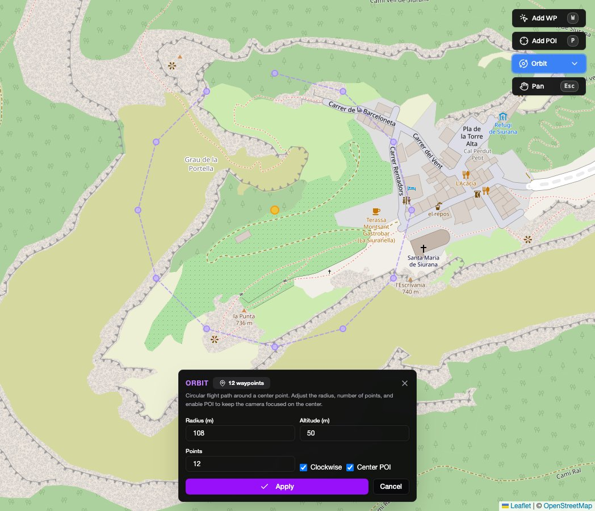
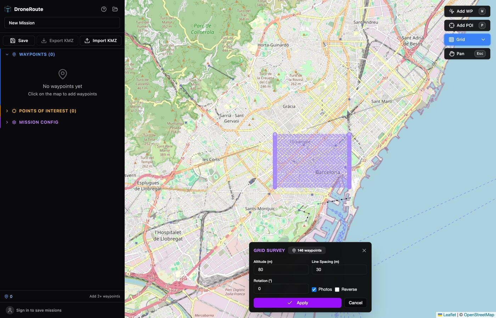
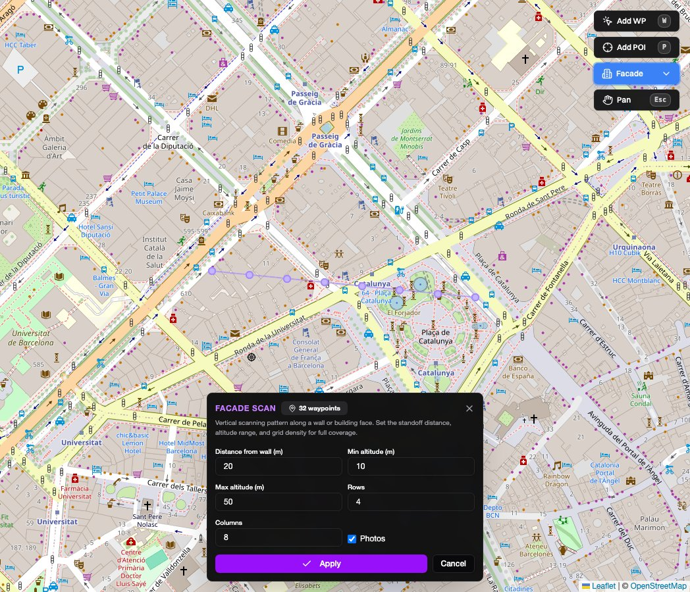
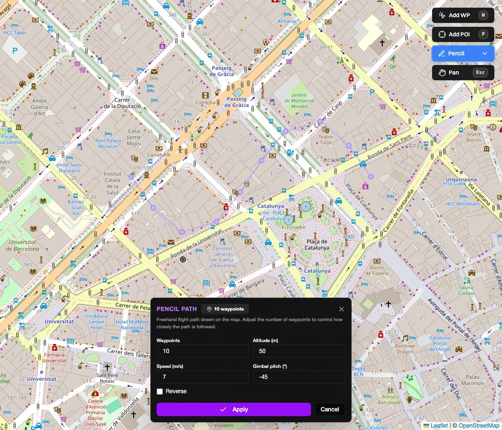
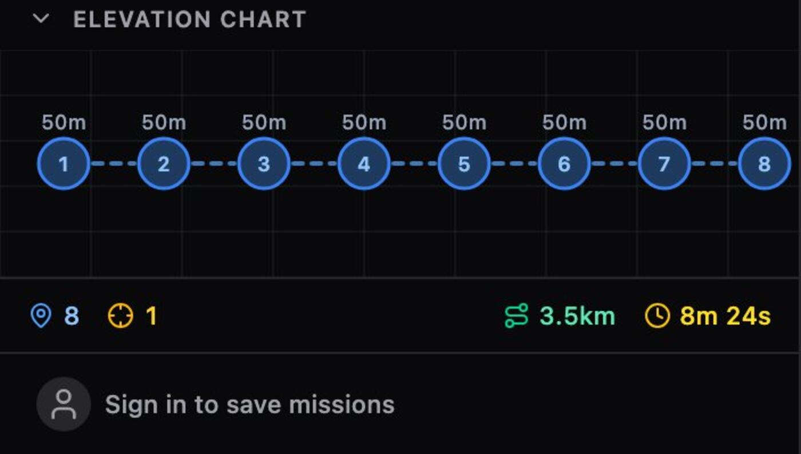

# DroneRoute User Guide

A complete guide to planning DJI waypoint missions with DroneRoute.

## Table of Contents

- [Quick Start](#quick-start)
- [Keyboard Shortcuts](#keyboard-shortcuts)
- [Waypoints](#waypoints)
- [Points of Interest (POIs)](#points-of-interest-pois)
- [Smart Gimbal Pitch](#smart-gimbal-pitch)
- [Waypoint Actions](#waypoint-actions)
- [Mission Templates](#mission-templates)
- [Mission Configuration](#mission-configuration)
- [Understanding the Map](#understanding-the-map)
- [KMZ Export & Import](#kmz-export--import)
- [Saving Missions](#saving-missions)
- [Sharing Missions](#sharing-missions)
- [Supported Drones](#supported-drones)
- [Tips & Tricks](#tips--tricks)

---

## Quick Start

1. Open DroneRoute in your browser
2. Click on the map to place waypoints (or press **W** first)
3. Adjust altitude, speed, and gimbal settings in the sidebar
4. Configure your drone model under **Mission config**
5. Click **KMZ** to export — load the file onto your DJI controller and fly

That's it. The rest of this guide covers every feature in detail.

---

## Keyboard Shortcuts

| Key | Action |
|-----|--------|
| `W` | Enter waypoint placement mode — click the map to add waypoints |
| `P` | Enter POI placement mode — click the map to add a Point of Interest |
| `O` | Start orbit template — click and drag on the map to define center + radius |
| `G` | Start grid survey template — click and drag to define the survey area |
| `F` | Start facade scan template — click and drag to define the wall line |
| `Z` | Start pencil path template — click and draw freehand on the map |
| `Esc` | Cancel current mode / deselect all |
| `Delete` / `Backspace` | Remove selected waypoint(s) |
| `Ctrl+A` / `Cmd+A` | Select all waypoints |

**Selection modifiers** (in the waypoint list):
- **Click** — select a single waypoint
- **Ctrl/Cmd + Click** — toggle selection (add/remove)
- **Shift + Click** — range select (from last selected to clicked)

---

## Waypoints

Waypoints are the core of every mission. Each waypoint defines a position, altitude, speed, and optional actions the drone should perform when it arrives.

### Placing Waypoints

- Press **W** or click the waypoint button in the map toolbar, then click anywhere on the map
- Each new waypoint inherits default settings (50m altitude, global speed)
- Waypoints appear in the sidebar list and are connected by the animated flight path on the map

### Editing Waypoints

Click a waypoint in the sidebar list (or on the map) to select it and open its inline editor. You can configure:

- **Name** — double-click the waypoint name in the list to rename it
- **Altitude (m)** — flight height at this waypoint
- **Speed (m/s)** — flight speed *to* this waypoint. Toggle "Use global speed" to inherit from mission config
- **Heading mode** — how the drone orients itself:
  - *Follow Wayline* — nose follows the flight direction
  - *Manual* — pilot controls heading
  - *Fixed* — maintain a specific heading angle
  - *Smooth Transition* — smoothly interpolate heading between waypoints
  - *Toward POI* — automatically face a selected Point of Interest
- **Turn mode** — how the drone transitions at each waypoint:
  - *Coordinated Turn* — smooth curved path (doesn't stop)
  - *To Point and Stop* — fly to the exact point, pause, then continue
  - *To Point and Pass* — fly through with continuity curvature (smooth, no stop)
- **Gimbal pitch** — camera tilt angle (-90 = straight down, 0 = horizon, up to 45)

### Reordering Waypoints

Drag waypoints in the sidebar list using the grip handle (the six-dot icon on the left) to reorder the flight path.

### Bulk Operations

Select multiple waypoints (Ctrl/Cmd+Click or Shift+Click), then use the bulk action toolbar that appears to:
- Delete all selected waypoints
- Apply the same altitude, speed, or other settings to multiple waypoints at once



---

## Points of Interest (POIs)

POIs are fixed positions on the map that waypoints can point toward. They're useful for inspection missions where the camera needs to stay focused on a specific target (a building, tower, bridge, etc.).

### Using POIs

1. Press **P** or click the POI button in the map toolbar
2. Click on the map to place the POI
3. Select a waypoint, set its heading mode to **Toward POI**, and choose the POI from the dropdown
4. The drone will automatically rotate to face the POI at that waypoint

### POI Height

Each POI has a height value. This is used together with the waypoint altitude to calculate the ideal gimbal pitch angle (see [Smart Gimbal Pitch](#smart-gimbal-pitch)).

---

## Smart Gimbal Pitch

When a waypoint is set to face a POI, DroneRoute can calculate the **perfect gimbal pitch** — the exact angle that points the camera directly at the POI.

### How It Works

The calculation uses basic trigonometry:

1. Compute the **horizontal distance** between the waypoint and POI (Haversine formula)
2. Compute the **height difference** (waypoint altitude minus POI height)
3. Calculate the angle: `pitch = -atan2(heightDiff, horizontalDist)`

For example, if your drone is 50m above a POI that's 100m away horizontally, the perfect pitch would be about -27 degrees.

### Using Perfect Pitch

When editing a waypoint that faces a POI, you'll see a green **"Perfect pitch: Xdeg"** button next to the gimbal pitch input:

- **Green and solid** — your current pitch already matches the ideal angle
- **Green and semi-transparent** — click it to apply the calculated angle



### Visual Feedback on the Map

Lines drawn between waypoints and their target POIs are color-coded:

- **Green solid line** — the gimbal pitch matches the ideal angle (camera is aimed correctly)
- **Red dashed line** — the pitch doesn't match (you should adjust it)

---

## Waypoint Actions

Each waypoint can have one or more actions that execute when the drone reaches that point. Click the settings icon on a waypoint to open the editor, then add actions.

### Available Actions

| Action | Description |
|--------|-------------|
| **Take Photo** | Captures a single photo |
| **Start Recording** | Begins video recording |
| **Stop Recording** | Stops video recording |
| **Gimbal Rotate** | Rotates the gimbal to a specific pitch and yaw angle |
| **Gimbal Smooth** | Smoothly interpolates the gimbal pitch from the current angle to the target angle between this waypoint and the next |
| **Rotate Yaw** | Rotates the aircraft to a specific heading (clockwise or counterclockwise) |
| **Hover** | Holds position for a specified number of seconds |
| **Zoom** | Sets the camera focal length (zoom level) |
| **Focus** | Sets the camera focus point (point or infinite focus) |

Actions execute in order when the drone arrives at the waypoint. You can add multiple actions to a single waypoint — for example, hover for 3 seconds, then take a photo.

---

## Mission Templates

Templates generate a set of waypoints automatically based on a pattern. They save time for common flight scenarios. After generating, you can still edit individual waypoints.

### Orbit

**Shortcut: O**

Creates a circular flight path around a center point. Click and drag on the map to define the center and radius.

**Configuration:**
- **Radius** — distance from center (determined by drag distance)
- **Altitude** — flight height (default 50m)
- **Number of points** — how many waypoints around the circle (3–72, default 12)
- **Clockwise** — orbit direction
- **Create POI** — automatically places a POI at the center so the camera faces inward

**Use cases:** Building inspections, tower surveys, cinematic orbits around a subject.

The gimbal pitch is automatically set to look toward the center point. If "Create POI" is enabled, waypoints are set to "Toward POI" heading mode for precise camera tracking.



### Grid Survey

**Shortcut: G**

Creates a lawn-mower (zigzag) pattern for systematic area coverage. Click and drag to define two corners of the survey area.

**Configuration:**
- **Altitude** — flight height (default 80m)
- **Line spacing** — distance between parallel passes in meters (default 30m)
- **Rotation** — rotate the grid pattern (-180 to 180 degrees)
- **Add photos** — automatically add a "Take Photo" action at each waypoint

**Use cases:** Mapping, photogrammetry, agricultural surveys, search and rescue.

The gimbal is set to -90 degrees (straight down) and heading follows the flight direction. The pattern automatically determines the most efficient orientation based on the shape of your survey area.



### Facade Scan

**Shortcut: F**

Creates a vertical scanning pattern parallel to a wall or building face. Click and drag to define the wall line (two endpoints).

**Configuration:**
- **Standoff distance** — how far from the wall to fly (default 20m)
- **Min/Max altitude** — vertical range of the scan (default 10–50m)
- **Rows** — number of horizontal passes (1–20, default 4)
- **Columns** — number of waypoints per row (2–30, default 8)

**Use cases:** Building facade inspections, wall surveys, structural assessments.

The drone flies back and forth in a zigzag pattern at increasing altitudes. Heading is automatically set to face the wall, and gimbal pitch adjusts per row to look at the wall base. A photo is taken at every waypoint.



### Pencil Path

**Shortcut: Z**

Draw a freehand flight path directly on the map. Click and drag to sketch the path, then adjust how many waypoints approximate it.

**Configuration:**
- **Waypoints** — number of waypoints along the path (2–200, default 10). More waypoints = closer approximation of the drawn shape
- **Altitude** — flight height (default 50m)
- **Speed** — flight speed (default 7 m/s)
- **Gimbal Pitch** — camera tilt angle (default -45°)
- **Reverse** — fly the path in the opposite direction

**Use cases:** Custom flight paths that don't fit a template, following roads or rivers, tracing building perimeters, artistic cinematic routes.

The waypoints are placed at equal arc-length intervals along the drawn path using equidistant resampling. The heading is set to "Follow Wayline" so the drone naturally faces the direction of travel, and the turn mode uses smooth continuity curvature to keep the flight fluid. After generating, a faded outline of the original drawn path is shown behind the waypoint preview so you can judge approximation quality.



---

## Mission Configuration

Open the **Mission config** section in the sidebar to configure global mission parameters.

| Setting | Description |
|---------|-------------|
| **Drone Model** | Select your DJI drone. This determines the KMZ metadata and available payloads |
| **Payload** | Camera/sensor selection (appears when the drone supports multiple payloads) |
| **Flight Speed** | Default speed for all waypoints using global speed (m/s) |
| **Takeoff Height** | Security height the drone climbs to before flying to the first waypoint |
| **Height Reference** | How altitude values are interpreted — Relative to Start, EGM96 (MSL), or Above Ground Level |
| **Heading Mode** | Default heading behavior for new waypoints |
| **Fly-to Mode** | How the drone reaches the first waypoint — *Safely* (climb then fly) or *Point to Point* (direct) |
| **Finish Action** | What happens after the last waypoint — Go Home, Auto Land, Return to WP1, or Hover |
| **RC Lost Action** | Behavior if the remote controller signal is lost — Return Home, Land, or Hover |
| **Transit Speed** | Speed used to fly from takeoff to the first waypoint |

---

## Understanding the Map

### Animated Dashed Lines

The blue dashed lines connecting waypoints represent the flight path. These lines are **animated** — the dashes flow in the direction of flight, giving you an intuitive sense of which way the drone will travel.

The **animation speed is proportional to the waypoint speed**. Faster waypoints produce quicker-moving dashes, slower waypoints produce slower animations. This lets you visually gauge relative speeds across different segments of your mission.

### POI Pointing Lines

When waypoints are set to face a POI, thin lines are drawn between them:

- **Green solid** = gimbal pitch is correctly aimed at the POI
- **Red dashed** = gimbal pitch needs adjustment

### Map Toolbar

The floating toolbar on the map provides:
- **Waypoint mode** (W) — click to place waypoints
- **POI mode** (P) — click to place points of interest
- **Template dropdown** — Orbit (O), Grid (G), Facade (F), Pencil (Z)

### Elevation Graph

Below the waypoint list, an elevation graph shows the altitude profile of your mission. This helps visualize altitude changes across the flight path.



---

## KMZ Export & Import

### Exporting

Click the **KMZ** button in the toolbar to download a `.kmz` file. This file follows the DJI WPML (Waypoint Markup Language) specification and contains:

- `template.kml` — mission template with all waypoint data and configuration
- `waylines.wpml` — the executable wayline file the DJI controller uses to fly

**Requirements:** You need at least 2 waypoints to export.

### Loading onto your DJI Controller

DJI Fly does not have a built-in import function for waypoint files. To load a KMZ you need to manually replace a placeholder mission on the controller's filesystem. Here's how:

1. **Create a placeholder mission** — On your DJI RC / RC 2 / RC Pro, open DJI Fly and create a simple dummy waypoint mission with 2 waypoints. Save it. This creates the folder structure you'll use.

2. **Connect the controller to your computer** — Use the USB-C port on the controller. You may need a file transfer app (e.g. Android File Transfer) to browse the controller's internal storage.

3. **Navigate to the waypoint folder** — Browse to:
   ```
   Android/data/dji.go.v5/files/waypoint
   ```

4. **Find the placeholder mission** — Look for the most recently modified folder. Folder names are long UUIDs like `550E8400-E29B-41D4-A716-446655440000`. Inside it you'll find a `.KMZ` file with the same name.

5. **Replace the file** — Copy your exported KMZ into this folder, delete the original placeholder KMZ, and rename your file to match the original filename exactly (the UUID name).

6. **Verify on the controller** — Disconnect, open DJI Fly, and select the mission. It will still show the old thumbnail, but once you open it in the editor the imported mission will appear.

> **Tip:** You can also peek inside `waypoint/map_preview` — it contains thumbnail images of each mission, making it easier to identify which folder is which.

### Importing

Click the **Import** button and select a `.kmz` file. DroneRoute will parse the DJI WPML data and reconstruct the mission, including:

- All waypoints with positions, altitudes, speeds, heading, and gimbal settings
- Waypoint actions (photos, video, gimbal rotations, etc.)
- Points of Interest (reconstructed from "Toward POI" heading references)
- Mission configuration (drone model, speeds, height mode, etc.)

This is useful for editing missions created in DJI Pilot 2 or other planning tools.

---

## Saving Missions

Sign in with an email and password to save missions to the server. Your saved missions are accessible from the **My routes** button (folder icon in the header).

- **Save** — saves the current mission (creates a new one or updates an existing one)
- **My Routes** — lists all your saved missions, click to load one

Missions are stored in a SQLite database on the server. If you're self-hosting, the database persists in a Docker volume.

---

## Sharing Missions

Share any saved mission with a read-only link. Recipients don't need an account to view the shared route.

### How to Share

1. Open **My routes** (folder icon in the header)
2. Click the **share** button on a mission card
3. A unique link is generated and copied to your clipboard
4. Send the link to anyone — they can open it in any browser

Shared missions display a green **"Shared"** badge on the card. Click the share button again to copy the link a second time.

### What Recipients See

When someone opens a share link, they see a read-only summary page with:

- **Mission name** and owner
- **Stats** — drone model, waypoint count, total distance, max altitude, estimated flight time
- **Open in editor** — loads the mission into the map editor (in-memory only, not saved)
- **Clone to my routes** — copies the mission into their own account (requires sign-in)
- **Export KMZ** — downloads the KMZ file directly without needing an account

### Revoking a Share

To stop sharing a mission, open **My routes** and click the **unshare** button (the link-off icon) on the shared card. The link becomes invalid immediately — anyone with the old URL will see a "route not found" message.

---

## Supported Drones

| Drone | Payloads |
|-------|----------|
| **DJI M300 RTK** | H20, H20T, H20N, PSDK |
| **DJI M350 RTK** | H20, H20T, H20N, H30, H30T, PSDK |
| **DJI M30** | M30 Camera |
| **DJI M30T** | M30T Camera |
| **DJI Mavic 3E** | M3E Camera |
| **DJI Mavic 3T** | M3T Camera |
| **DJI Mavic 3M** | M3M Camera |
| **DJI Mavic 3D** | M3D Camera |
| **DJI Mavic 3TD** | M3TD Camera |
| **DJI Mini 4 Pro** | Mini 4 Pro Camera |

The PSDK (Payload SDK) option on M300/M350 represents third-party payloads.

---

## Tips & Tricks

### Speed-based animation

Watch the animated flight path on the map. The dashes move faster where the drone flies faster — use this to visually verify speed changes across your mission.

### Quick altitude changes

Select multiple waypoints with **Ctrl/Cmd+Click**, then use the bulk editor to set them all to the same altitude at once.

### Orbit + POI combo

When creating an orbit template with "Create POI" enabled, the generated POI at the center means all waypoints automatically track it. After generating, you can adjust individual waypoints or move the POI to offset the camera target from the orbit center.

### Facade scan overlap

For photogrammetry, reduce the column spacing in facade scan templates to ensure sufficient image overlap. A good rule of thumb is 70-80% overlap between adjacent photos.

### Gimbal smooth for cinematic shots

Use the **Gimbal Smooth** action to create gradual camera tilts between waypoints. Set the target pitch at one waypoint and the gimbal will interpolate smoothly during flight to the next waypoint.

### Import and edit

If you've already created a mission in DJI Pilot 2, import the KMZ into DroneRoute to make fine-tuned adjustments — then export a new KMZ with your changes.

### Height reference matters

Choose your height reference carefully:
- **Relative to Start** — simplest, altitudes are relative to the takeoff point
- **EGM96 (MSL)** — altitudes are above mean sea level, useful for consistent heights across long distances
- **Above Ground Level** — the drone maintains a fixed height above terrain (requires terrain data on the controller)

### Self-hosting for privacy

DroneRoute can be fully self-hosted with Docker. Your mission data stays on your own server — no data is sent to any third-party service.

---

## Disclaimer

DroneRoute is an independent, community-driven project. It is not affiliated with, endorsed by, or sponsored by DJI. "DJI" and related product names are trademarks of SZ DJI Technology Co., Ltd.
