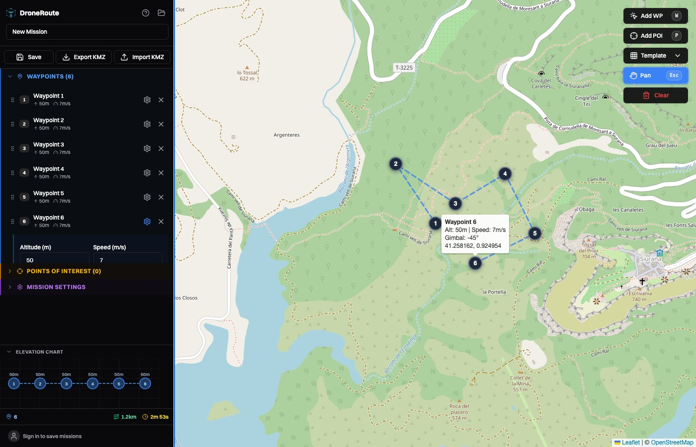

# DroneRoute

[](https://github.com/fcsonline/droneroute/actions/workflows/ci.yml)

A free, open-source mission planner for DJI drones. Plan waypoint missions on an interactive map, tweak flight parameters, and export KMZ files ready to fly.

**[Try the live demo](https://droneroute.fly.dev)**



## Features

- **Interactive map** — Click to place waypoints and Points of Interest on OpenStreetMap
- **Waypoint configuration** — Set altitude, speed, gimbal pitch, heading mode, and turn mode per waypoint
- **Points of Interest** — Define POIs and auto-point the camera toward them
- **Smart gimbal pitch** — Automatically calculates the optimal gimbal angle based on distance and height to a POI
- **Waypoint actions** — Add photo, video, gimbal rotate, yaw, hover, zoom, and focus actions
- **KMZ export & import** — Generates DJI WPML-compliant KMZ files, or load existing ones
- **Save & load** — Persist missions to a local database with user accounts
- **Mission templates** — Orbit, grid survey, and facade scan presets to get you flying faster
- **Animated flight path** — Dashed lines animate in flight direction, proportional to each waypoint's speed
- **Drag-and-drop reordering** — Reorder waypoints by dragging in the sidebar
- **Keyboard shortcuts** — `W` add waypoint, `P` add POI, `Esc` deselect, `Delete` remove selected
- **Self-hosted** — Run it on your own machine or server with Docker

## Supported Drones

DJI M300 RTK, M350 RTK, M30/M30T, Mavic 3E/3T/3M/3D/3TD, Mini 4 Pro.

## Getting Started

You'll need **Node.js 22+** and **npm 10+**.

```bash
# Clone the repo
git clone https://github.com/fcsonline/droneroute.git
cd droneroute

# Install dependencies
npm install

# Build the shared types package (required before first run)
npm run build -w packages/shared

# Start both backend and frontend in dev mode
npm run dev
```

That's it! Open `http://localhost:5173` and start planning missions.

### Docker

Prefer Docker? One command:

```bash
docker compose up -d
# Open http://droneroute.localhost
```

## Tech Stack

| Layer | Technology |
|-------|-----------|
| Frontend | React 19, TypeScript, Vite 6, Tailwind CSS v4, shadcn/ui, Zustand, Leaflet |
| Backend | Node.js, Express 5, better-sqlite3, JWT auth |
| Shared | TypeScript types package shared between frontend and backend |
| Infrastructure | Docker, Traefik, SQLite |

The project is organized as an npm monorepo with three packages: `shared`, `backend`, and `frontend`.

## Contributing

Contributions are welcome! Whether it's a bug fix, a new feature, or improving the docs — every bit helps.

1. Fork the repo
2. Create a branch (`git checkout -b my-feature`)
3. Make your changes
4. Run the dev server and make sure things work (`npm run dev`)
5. Open a Pull Request

If you find a bug or have an idea, feel free to [open an issue](https://github.com/fcsonline/droneroute/issues). We'd love to hear from you.

## License

MIT
